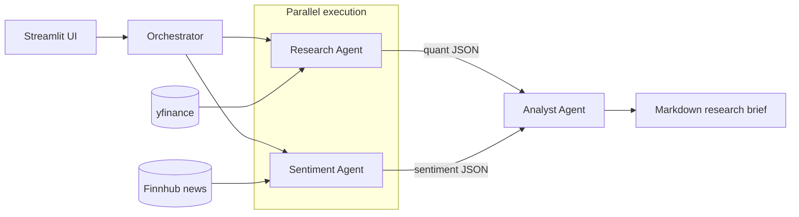

# Finance Research Engine

Multi-agent financial research system built with Google's Agent Development Kit (ADK) and Gemini.
An Orchestrator runs a quantitative Research Agent and a qualitative Sentiment Agent in parallel,
then a synthesis-only Analyst Agent combines both into a markdown research brief. A Streamlit
frontend sits on top.

## Architecture



Research and Sentiment run concurrently via ADK's `ParallelAgent` (fan-out), and their structured
JSON outputs are fed into the Analyst Agent via ADK's `SequentialAgent` (fan-in) for synthesis —
each agent has a single, narrow responsibility and no agent invents data outside its own tool's
output.

**Currently implemented**: the full pipeline — yfinance tool + Research Agent, Finnhub news
tool + Sentiment Agent, and the Orchestrator + Analyst Agent that runs the first two in
parallel and synthesizes a markdown brief.

## Setup

```bash
python3.12 -m venv .venv
source .venv/bin/activate
pip install -r requirements.txt
cp .env.example .env   # then fill in GOOGLE_API_KEY (https://aistudio.google.com/apikey)
                        # and FINNHUB_API_KEY (https://finnhub.io/register, free tier, 60 calls/min)
```

## Project layout

- `schemas.py` — shared Pydantic models for every tool/agent output shape: `StockData`/`StockDataError`,
  `Headline`, `NewsData`/`NewsDataError`, `SentimentAssessment`/`SentimentAssessmentError`,
  `ResearchBrief` (the orchestrator's return contract).
- `tools/stock_data_tool.py` — `get_stock_data(ticker)`, wraps yfinance, never raises.
- `tools/news_tool.py` — `get_company_news(ticker)`, wraps Finnhub, headlines only (no sentiment
  computed here), never raises.
- `agents/research_agent.py` — `build_research_agent(output_key=None)` factory + a standalone
  `research_agent` singleton; quantitative-only, JSON-only output.
- `agents/sentiment_agent.py` — `build_sentiment_agent(output_key=None)` factory + a standalone
  `sentiment_agent` singleton; the agent itself judges bullish/bearish/neutral from raw headlines
  and must cite the specific ones (copied verbatim from the tool) it relied on.
- `agents/analyst_agent.py` — `build_analyst_agent()` factory + a standalone `analyst_agent`
  singleton; synthesis-only, no tools, turns the other two agents' structured JSON into a markdown
  brief. Instruction hard-requires: numbers only from the provided research JSON, sentiment framed
  as media tone (never a buy/sell call), a verbatim "informational research only, not investment
  advice" disclaimer, and a "data as of" timestamp injected by the orchestrator (not left for the
  LLM to guess).
- `agents/orchestrator.py` — `build_pipeline()` wires `ParallelAgent([research, sentiment])` into
  `SequentialAgent([..., analyst])` (ADK's idiomatic composition for this fan-out/fan-in shape;
  both classes are deprecated in the installed adk-python version in favor of a lower-level
  Workflow/Node/Edge API that isn't yet a drop-in replacement — revisit later). `run_research_brief(ticker)`
  runs it end-to-end and returns a `ResearchBrief`.

  Every `build_*` function returns a **fresh** agent instance — ADK raises a `ValidationError` if
  the same agent object is attached as a sub-agent of more than one parent, so the orchestrator
  never reuses the standalone singletons above.
- `run_research_agent.py`, `run_orchestrator.py` — manual CLIs, e.g. `python run_orchestrator.py AAPL`.
- `tests/` — pytest suite. Real network/live-agent calls, no mocking, with one exception: Finnhub
  rate-limit/network-failure handling is tested via `monkeypatch` (deliberately triggering a
  real 429 would be slow, flaky, and burn shared free-tier quota). The orchestrator's Analyst-only
  tests similarly seed session state directly to test its constraints cheaply, without paying for
  the upstream agents' tool calls on every run.

## Running tests

```bash
# Tool tests only (no LLM calls, no GOOGLE_API_KEY needed)
pytest tests/test_stock_data_tool.py tests/test_news_tool.py -v

# Full suite, including all three agents (needs GOOGLE_API_KEY and FINNHUB_API_KEY in .env)
pytest -v
```

## Manual run

```bash
python run_research_agent.py AAPL
python run_research_agent.py ZZZZZZINVALID
python run_orchestrator.py AAPL
```

## Notes on model selection

All three agents currently use `gemini-3.5-flash-lite`. This has moved a few times already: the
original target `gemini-2.5-flash` was deprecated for new API keys, its replacement
`gemini-3.6-flash` hit its free-tier daily quota (20 requests/day/model) from repeated test runs,
and `gemini-2.5-flash-lite` turned out to be deprecated too. See `agents/*.py` — swap the `model=`
string there if you hit another quota wall or want a different model. Note the free tier also caps
requests at 15/minute/model — running the full test suite plus a manual CLI call back-to-back can
transiently 429; that's expected and clears within a few seconds, not a code issue.
