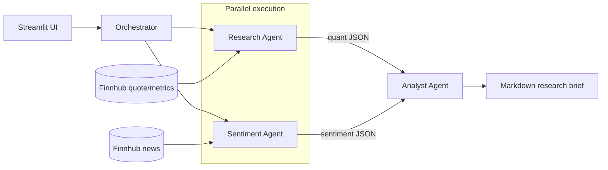

# Finance Research Engine

Multi-agent financial research system built with Google's Agent Development Kit (ADK) and Gemini.
An Orchestrator runs a quantitative Research Agent and a qualitative Sentiment Agent in parallel,
then a synthesis-only Analyst Agent combines both into a markdown research brief. A Streamlit
frontend sits on top.

## Architecture



Research and Sentiment run concurrently via ADK's `ParallelAgent` (fan-out), and their structured
JSON outputs are fed into the Analyst Agent via ADK's `SequentialAgent` (fan-in) for synthesis —
each agent has a single, narrow responsibility and no agent invents data outside its own tool's
output.

**Currently implemented**: the full pipeline — Finnhub stock data tool + Research Agent, Finnhub news
tool + Sentiment Agent, and the Orchestrator + Analyst Agent that runs the first two in
parallel and synthesizes a markdown brief.

## Setup

```bash
python3.12 -m venv .venv
source .venv/bin/activate
pip install -r requirements.txt
cp .env.example .env   # then fill in GOOGLE_API_KEY (https://aistudio.google.com/apikey)
                        # and FINNHUB_API_KEY (https://finnhub.io/register, free tier, 60 calls/min)
```

## Project layout

- `schemas.py` — shared Pydantic models for every tool/agent output shape.
- `tools/stock_data_tool.py` — `get_stock_data(ticker)`, wraps Finnhub.
- `tools/news_tool.py` — `get_company_news(ticker)`, wraps Finnhub for raw headlines.
- `agents/research_agent.py` — quantitative Research Agent; JSON-only output (price, P/E, revenue growth).
- `agents/sentiment_agent.py` — qualitative Sentiment Agent; judges bullish/bearish/neutral from headlines, with citations.
- `agents/analyst_agent.py` — synthesis-only Analyst Agent; combines both agents' JSON into the final markdown brief.
- `agents/orchestrator.py` — wires Research + Sentiment (`ParallelAgent`) into the Analyst step (`SequentialAgent`) and runs the pipeline end-to-end.
- `run_research_agent.py`, `run_orchestrator.py` — manual CLIs, e.g. `python run_orchestrator.py AAPL`.
- `tests/` — pytest suite; real network/live-agent calls, no mocking (aside from a couple of deliberately isolated cases).

## Running tests

```bash
# Tool tests only (no LLM calls, no GOOGLE_API_KEY needed)
pytest tests/test_stock_data_tool.py tests/test_news_tool.py -v

# Full suite, including all three agents (needs GOOGLE_API_KEY and FINNHUB_API_KEY in .env)
pytest -v
```

## Manual run

```bash
python run_research_agent.py AAPL
python run_research_agent.py ZZZZZZINVALID
python run_orchestrator.py AAPL
```

## Notes on model selection

All three agents currently use `gemini-3.5-flash-lite` — swap the `model=` string in `agents/*.py`
if you hit a quota wall or want a different model. The free tier caps requests at 15/minute/model,
so running the full test suite plus a manual CLI call back-to-back can transiently 429; that's
expected and clears within a few seconds, not a code issue.