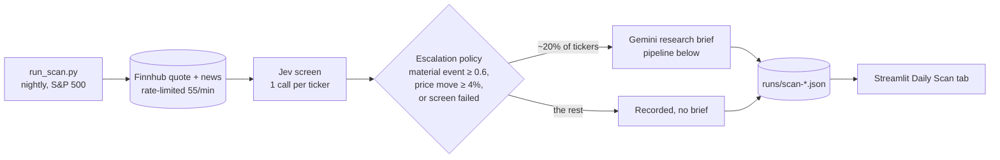
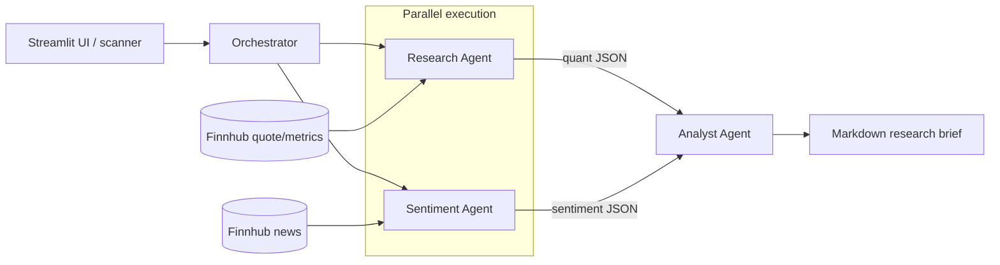

# Finance Research Engine

Multi-agent financial research system built with Google's Agent Development Kit (ADK) and Gemini,
plus a cheap screening layer that makes it practical to run nightly over the whole S&P 500.

- **Research briefs**: an Orchestrator runs a quantitative Research Agent and a qualitative Sentiment
  Agent in parallel, then a synthesis-only Analyst Agent combines both into a markdown brief.
- **Nightly scan**: [Jev](https://docs.typesafe.ai/models) (TypeSafe AI's "System 1" decision model)
  screens every ticker in one cheap call, and a deterministic policy sends only tickers with a likely
  material event to the full Gemini pipeline.
- **Evaluation**: Jev vs. Gemini on identical cached headlines, scored against hand labels, with the
  escalation policy chosen on one labeled set and tested on a held-out one ([Results](#results)).
- **Streamlit UI**: single-ticker briefs, and a Daily Scan tab for the latest scan report.

## Architecture

Nightly scan - screen everything cheaply, brief only what matters:



Research brief pipeline - used for single-ticker requests and escalated tickers:



Research and Sentiment run concurrently via ADK's `ParallelAgent` (fan-out), and their structured
JSON outputs are fed into the Analyst Agent via ADK's `SequentialAgent` (fan-in) for synthesis —
each agent has a single, narrow responsibility and no agent invents data outside its own tool's
output.

## Setup

```bash
python3.12 -m venv .venv
source .venv/bin/activate
pip install -r requirements.txt
cp .env.example .env   # then fill in GOOGLE_API_KEY (https://aistudio.google.com/apikey),
                        # FINNHUB_API_KEY (https://finnhub.io/register, free tier, 60 calls/min)
                        # and TYPESAFE_API_KEY (https://docs.typesafe.ai, for Jev)
streamlit run app.py
```

## Project layout

- `schemas.py` — shared Pydantic models for every tool/agent output shape.
- `tools/stock_data_tool.py` — `get_stock_data(ticker)`, wraps Finnhub.
- `tools/news_tool.py` — `get_company_news(ticker)`, wraps Finnhub for raw headlines.
- `agents/research_agent.py` — quantitative Research Agent; JSON-only output (price, P/E, revenue growth).
- `agents/sentiment_agent.py` — qualitative Sentiment Agent; judges bullish/bearish/neutral from headlines, with citations.
- `agents/analyst_agent.py` — synthesis-only Analyst Agent; combines both agents' JSON into the final markdown brief.
- `agents/orchestrator.py` — wires Research + Sentiment (`ParallelAgent`) into the Analyst step (`SequentialAgent`) and runs the pipeline end-to-end.
- `run_research_agent.py`, `run_orchestrator.py` — manual CLIs, e.g. `python run_orchestrator.py AAPL`.
- `tools/jev_screen.py` — `screen_ticker`, one Jev call answering sentiment, material event and needs-analysis.
- `tools/rate_limit.py` — shared token bucket keeping the scanner under Finnhub's rate limit.
- `screener/policy.py` — deterministic escalation policy; `screener/scan.py` — `run_scan` over a universe.
- `run_scan.py` — scanner CLI (see [Scanning a universe](#scanning-a-universe)).
- `eval/` — Jev vs. Gemini eval against hand labels (`build_dataset`, `label`, `compare`, `tune_questions`).
- `tests/` — pytest suite; real network/live-agent calls, no mocking (aside from a couple of deliberately isolated cases).

## Running tests

```bash
# Tool tests only (no LLM calls, no GOOGLE_API_KEY needed)
pytest tests/test_stock_data_tool.py tests/test_news_tool.py -v

# Full suite, including all three agents (needs GOOGLE_API_KEY and FINNHUB_API_KEY in .env)
pytest -v
```

## Manual run

```bash
python run_research_agent.py AAPL
python run_research_agent.py ZZZZZZINVALID
python run_orchestrator.py AAPL
```

## Scanning a universe

`run_scan.py` screens every ticker in a `data/universes/*.txt` list with Jev, applies the escalation
policy (`screener/policy.py`), and runs the full Gemini brief for escalated tickers. Each run writes
`runs/scan-<timestamp>.json` (gitignored). Finnhub's 60 calls/min free tier sets the pace: about 6
minutes for the S&P 100, 27 for the S&P 500. Reports keep each ticker's headlines, so a past scan can
be re-screened with reworded Jev questions or labeled as an eval set.

```bash
python run_scan.py --universe sp100 --limit 10 --no-escalate   # smoke test, Jev only
python run_scan.py --universe sp500 --no-escalate              # decisions only, ~2.5 cents
python run_scan.py --universe sp500 --max-briefs 20            # brief the 20 strongest escalations
```

`--no-escalate` records every decision without running briefs, so a scan costs only Jev calls and can
be re-scored against a different policy later. Gemini's free tier (15 requests/min per model) fits only
a few briefs a minute, so cap briefs with `--max-briefs` rather than escalating a whole universe.

### Nightly run (macOS launchd)

US markets close at 16:00 ET, so schedule after that, on nights following a trading day only - a
weekend scan sees Friday's data again. Save as
`~/Library/LaunchAgents/com.finance-research-engine.scan.plist`, fixing the two paths:

```xml
<?xml version="1.0" encoding="UTF-8"?>
<!DOCTYPE plist PUBLIC "-//Apple//DTD PLIST 1.0//EN" "http://www.apple.com/DTDs/PropertyList-1.0.dtd">
<plist version="1.0">
<dict>
  <key>Label</key><string>com.finance-research-engine.scan</string>
  <key>WorkingDirectory</key><string>/path/to/Finance Research Engine</string>
  <key>ProgramArguments</key>
  <array>
    <string>/path/to/Finance Research Engine/.venv/bin/python</string>
    <string>run_scan.py</string><string>--universe</string><string>sp500</string><string>--no-escalate</string>
  </array>
  <!-- Local time, Tue-Sat (launchd weekday 0 = Sunday): 03:00 IST is 17:30 ET the previous
       day (16:30 while the US is on standard time), so each run follows a Mon-Fri close. -->
  <key>StartCalendarInterval</key>
  <array>
    <dict><key>Weekday</key><integer>2</integer><key>Hour</key><integer>3</integer><key>Minute</key><integer>0</integer></dict>
    <dict><key>Weekday</key><integer>3</integer><key>Hour</key><integer>3</integer><key>Minute</key><integer>0</integer></dict>
    <dict><key>Weekday</key><integer>4</integer><key>Hour</key><integer>3</integer><key>Minute</key><integer>0</integer></dict>
    <dict><key>Weekday</key><integer>5</integer><key>Hour</key><integer>3</integer><key>Minute</key><integer>0</integer></dict>
    <dict><key>Weekday</key><integer>6</integer><key>Hour</key><integer>3</integer><key>Minute</key><integer>0</integer></dict>
  </array>
  <key>StandardOutPath</key><string>/Users/you/Library/Logs/finance-research-engine-scan.log</string>
  <key>StandardErrorPath</key><string>/Users/you/Library/Logs/finance-research-engine-scan.log</string>
</dict>
</plist>
```

```bash
launchctl bootstrap gui/$(id -u) ~/Library/LaunchAgents/com.finance-research-engine.scan.plist   # install
launchctl kickstart gui/$(id -u)/com.finance-research-engine.scan                                # run now
tail -f ~/Library/Logs/finance-research-engine-scan.log                                         # watch
launchctl bootout gui/$(id -u)/com.finance-research-engine.scan                                  # uninstall
```

- API keys come from the repo's `.env` (`run_scan.py` loads it), so none go in the plist.
- launchd runs a missed job when the Mac wakes, but not if it was shut down. To wake it for the run,
  `sudo pmset repeat wakeorpoweron TWRFS 02:55:00`.
- Keeping the repo in `~/Desktop` or `~/Documents` can trip macOS privacy protection for background
  jobs ("Operation not permitted"). Test once with a small `--limit` job; if blocked, grant the Python
  binary Full Disk Access or move the repo elsewhere.
- If Jev rejects the key or the account is out of credits, the run stops with exit code 2 and writes
  no report, so the log shows the reason instead of 503 failed tickers.

On Linux, the cron equivalent is
`0 3 * * 2-6 cd /path/to/repo && .venv/bin/python run_scan.py --universe sp500 --no-escalate`.

## Results

> **Provider change.** The results below were first measured with Jev served through Vercel AI Gateway
> (`typesafe-ai/jev`, through 2026-09-26). Vercel then restricted Jev to paid credits. Re-running the
> locked policy on the same held-out labels with `jev-1.13.0` through Requesty gave the same result: 8/8 events at 28% escalation, 29% precision,
> 70% sentiment accuracy, 0 failures, $0.0041 for all 100 tickers
> (`eval/results/compare-2026-09-27T070245Z.md`). The code now calls the same pinned model through
> TypeSafe's own API (`api.typesafe.ai/v1/systemone`), where it gave 8/8 at 26% escalation, 73%
> sentiment accuracy, 0 failures and 414 ms median latency
> (`eval/results/compare-2026-09-27T114225Z.md`). TypeSafe reports token counts but no per-call cost,
> so Jev cost is now tokens x list price ($0.042/M), labelled as an estimate.

### Screening: held-out test set

The escalation policy was chosen on one hand-labeled set, committed, and only then evaluated on a
second set labeled afterwards (100 random S&P 500 tickers outside the S&P 100). The held-out numbers
are the ones to quote; the development set is shown for comparison.

| | Development set | **Held-out test set** |
|---|---|---|
| Tickers (hand-labeled, blind to model output) | 102 (S&P 100) | **100** (rest of S&P 500) |
| Labeled material events | 7 | **8** |
| Events escalated (recall) | 7 / 7 | **8 / 8** |
| Tickers escalated | 26% | **26-30%** |
| Escalations that were labeled events (precision) | 26% | **27-31%** |
| Gemini briefs avoided vs. briefing every ticker | 74% | **70-74%** |

Held-out ranges span five Jev runs on the same headlines: the nightly scan's answers (27% escalated,
0 failures), a fresh re-screen (`eval/results/compare-2026-09-26T123753Z.md`: 30% escalated, of
which 4 tickers were Jev errors escalated to be safe), a re-run through Requesty (28%, 0 failures) and
two through TypeSafe's own API (`eval/results/compare-2026-09-27T114225Z.md`: 26%;
`eval/results/compare-2026-09-27T203931Z.md`: 27%; 0 failures). Every run caught all 8 events; Jev's
answers vary slightly between runs.

On the first full S&P 500 scan the policy escalates 108 of 503 tickers (21%), so a nightly run needs
~108 briefs instead of 503.

The policy that won - `material_event >= 0.6` (plus a 4% price-move rule and escalation on any
screening failure) - replaced an earlier one that also escalated on Jev's `needs_analysis` answer
and on low sentiment confidence. On the held-out set the earlier policy caught the same 8 events
but escalated 60% of tickers.

### Sentiment: Jev vs. Gemini

Both models judged identical cached headlines; accuracy is against the hand labels.

| | Jev | Gemini (Sentiment Agent) |
|---|---|---|
| **Accuracy, held-out set** (100; 99 compared by both) | **71%** (70-73% across runs) | **70%** |
| Accuracy, development set (93 screened) | 73% | 71% |
| Jev-Gemini agreement, held-out | 74% | |
| Cost per ticker | ~$0.000044-0.0000475 | ~$0.0020 (estimated) - **45x Jev** |
| Median latency | ~0.5-0.6 s | ~3.5 s - **~6.5x Jev** |

On data neither was tuned on, Jev matches the Gemini Sentiment Agent's accuracy at ~1/45th of the
cost - and answers material event and needs-analysis in the same call
(`eval/results/compare-2026-09-27T203931Z.md`).

### Scale

First S&P 500 scan (Jev only): 503/503 tickers screened, 0 failures, $0.022 of Jev calls, median
Jev latency 575 ms (p95 1,013 ms), ~28 minutes end to end - bound by Finnhub's free-tier rate limit,
not the models. A second full scan (27 Sep): 503/503, 0 failures, 96 flagged (19%).

End to end with briefs (S&P 100, `--max-briefs 10`, `runs/scan-2026-09-27T205045Z.json`): 103
screened, 0 failures, 20 flagged (19%), and all 10 capped briefs generated - a measured **$0.0057 per
brief** (range $0.0049-0.0066; ~6,300 input / 1,500 output tokens, Gemini estimated from tokens).
The run took 6.8 minutes.

**What a nightly S&P 500 run costs**, at that brief cost and 19-21% of tickers flagged:

| | Per night | Per month (~22 weeknights) |
|---|---|---|
| A. Full Gemini brief for every ticker (503 briefs) | ~$2.87 | ~$63 |
| B. Jev screen all 503, brief only the ~96-108 flagged | ~$0.57-0.64 | ~$13-14 |
| **Saving** | **~78-80%** | **~$50/month** |

B also makes ~100 Gemini briefs a night instead of 503 - with three Gemini requests per brief, well
within paid-tier rate limits, where briefing everything would not fit Gemini's free tier at all.

## Evaluation method

- **Cached inputs** (`eval/build_dataset.py`): quotes and headlines are fetched once and saved, so
  every model and every rerun sees identical inputs. Held-out sets are built from a scan report with a
  seeded random sample (`--from-scan --sample --exclude-universe`).
- **Hand labels** (`eval/label.py`): sentiment plus "material event?" per ticker, entered blind - the
  labeler shows only headlines and the price move, never a model's answer. Labeling rules are in
  [`eval/LABELING.md`](eval/LABELING.md): a material event is one of six categories (earnings surprise,
  guidance change, M&A, major litigation, regulatory action, executive change) - the same list Jev is
  asked about.
- **Comparison** (`eval/compare.py`): accuracy vs. labels, Jev-Gemini agreement and confusion matrix,
  escalation recall/precision per policy, a threshold sweep, and per-ticker cost and latency. Reports
  are in `eval/results/`.
- **Development/test split**: the policy was picked on the development set and committed
  (`6042f25`) before the held-out set was labeled (`d0176da`), so the held-out result measures it
  untuned. Question wordings were tried with `eval/tune_questions.py`.

## Limitations

- **Few positive examples.** 15 labeled material events across both sets; 8/8 on the held-out set is
  consistent with a true recall well below 100% (>= 63% at 95% confidence, exact binomial; 15/15
  across both sets gives >= 78%). The event rate will grow with more nightly scans, especially in earnings season.
- **Low precision.** About 70% of escalations are false alarms. Fine for a screen whose job is to not
  miss events, but there's room to cut briefs further.
- **Development labels were revised.** A first labeling pass marked 43 of 102 tickers material; an
  audit against the written six-category rules cut that to 7 (earnings dates, analyst ratings and
  routine dividends had been counted). The audit happened after seeing which tickers Jev missed, so the
  development numbers may flatter Jev - which is why the policy is judged on the held-out set, labeled
  blind after the policy was fixed.
- **Single labeler.** All labels are one person's judgement; there's no inter-annotator agreement.
- **Headlines only.** Jev sees ~7 days of headlines and today's move - no filings, transcripts or prices
  beyond the quote. Week-old events can re-trigger escalation.
- **Estimated costs.** Gemini's cost is token counts x list price (`pricing.py`). Jev's was exact on
  Vercel and Requesty, which report cost per call; TypeSafe's API reports only token counts, so it is
  now estimated the same way (exact tokens, $0.042/M list price).
- **Paid model.** Jev now needs paid credits on every provider (~$0.04 per 100 tickers screened), so
  running the scanner or the eval needs your own `TYPESAFE_API_KEY` with credits.
- **Early-access model.** Jev returned intermittent 5xx errors in its first weeks (retried; failures
  escalate rather than drop a ticker), and its behaviour may change between versions - every result
  records the model that produced it.

## Deploying (Streamlit Community Cloud)

1. At [share.streamlit.io](https://share.streamlit.io), create an app from this repository: branch
   `master`, main file `app.py`, Python 3.12 (under *Advanced settings*).
2. Paste the keys into the app's **Secrets** (never into the repo):

   ```toml
   GOOGLE_API_KEY = "..."
   FINNHUB_API_KEY = "..."
   TYPESAFE_API_KEY = "..."
   GOOGLE_GENAI_USE_VERTEXAI = "FALSE"
   ```

A deployed copy has no nightly job writing to `runs/`, so the Daily Scan tab and the top strip use
the sample reports committed in `data/demo/` (the 27 Sep 2026 S&P 500 scan and an S&P 100 scan with
10 briefs), labelled "sample scan". Single ticker screening and briefs run live on your keys.
Streamlit Cloud sleeps inactive apps, so the first visit after a while takes ~30 s to wake.

## Notes on model selection

All three agents currently use `gemini-3.5-flash-lite` — swap the `model=` string in `agents/*.py`
if you hit a quota wall or want a different model. The free tier caps requests at 15/minute/model,
so running the full test suite plus a manual CLI call back-to-back can transiently 429; that's
expected and clears within a few seconds, not a code issue.