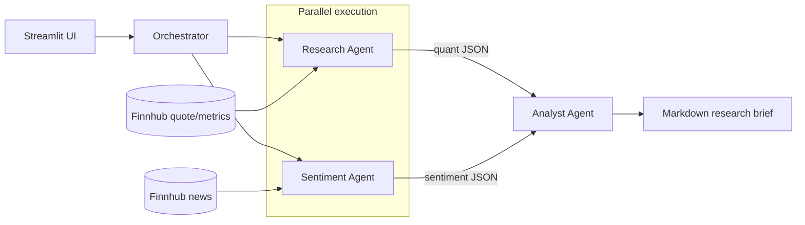

# Finance Research Engine

Multi-agent financial research system built with Google's Agent Development Kit (ADK) and Gemini.
An Orchestrator runs a quantitative Research Agent and a qualitative Sentiment Agent in parallel,
then a synthesis-only Analyst Agent combines both into a markdown research brief. A Streamlit
frontend sits on top.

## Architecture



Research and Sentiment run concurrently via ADK's `ParallelAgent` (fan-out), and their structured
JSON outputs are fed into the Analyst Agent via ADK's `SequentialAgent` (fan-in) for synthesis —
each agent has a single, narrow responsibility and no agent invents data outside its own tool's
output.

**Currently implemented**: the full pipeline — Finnhub stock data tool + Research Agent, Finnhub news
tool + Sentiment Agent, and the Orchestrator + Analyst Agent that runs the first two in
parallel and synthesizes a markdown brief.

## Setup

```bash
python3.12 -m venv .venv
source .venv/bin/activate
pip install -r requirements.txt
cp .env.example .env   # then fill in GOOGLE_API_KEY (https://aistudio.google.com/apikey)
                        # and FINNHUB_API_KEY (https://finnhub.io/register, free tier, 60 calls/min)
```

## Project layout

- `schemas.py` — shared Pydantic models for every tool/agent output shape.
- `tools/stock_data_tool.py` — `get_stock_data(ticker)`, wraps Finnhub.
- `tools/news_tool.py` — `get_company_news(ticker)`, wraps Finnhub for raw headlines.
- `agents/research_agent.py` — quantitative Research Agent; JSON-only output (price, P/E, revenue growth).
- `agents/sentiment_agent.py` — qualitative Sentiment Agent; judges bullish/bearish/neutral from headlines, with citations.
- `agents/analyst_agent.py` — synthesis-only Analyst Agent; combines both agents' JSON into the final markdown brief.
- `agents/orchestrator.py` — wires Research + Sentiment (`ParallelAgent`) into the Analyst step (`SequentialAgent`) and runs the pipeline end-to-end.
- `run_research_agent.py`, `run_orchestrator.py` — manual CLIs, e.g. `python run_orchestrator.py AAPL`.
- `tools/jev_screen.py` — `screen_ticker`, one Jev call answering sentiment, material event and needs-analysis.
- `tools/rate_limit.py` — shared token bucket keeping the scanner under Finnhub's rate limit.
- `screener/policy.py` — deterministic escalation policy; `screener/scan.py` — `run_scan` over a universe.
- `run_scan.py` — scanner CLI (see [Scanning a universe](#scanning-a-universe)).
- `eval/` — Jev vs. Gemini eval against hand labels (`build_dataset`, `label`, `compare`, `tune_questions`).
- `tests/` — pytest suite; real network/live-agent calls, no mocking (aside from a couple of deliberately isolated cases).

## Running tests

```bash
# Tool tests only (no LLM calls, no GOOGLE_API_KEY needed)
pytest tests/test_stock_data_tool.py tests/test_news_tool.py -v

# Full suite, including all three agents (needs GOOGLE_API_KEY and FINNHUB_API_KEY in .env)
pytest -v
```

## Manual run

```bash
python run_research_agent.py AAPL
python run_research_agent.py ZZZZZZINVALID
python run_orchestrator.py AAPL
```

## Scanning a universe

`run_scan.py` screens every ticker in a `data/universes/*.txt` list with Jev, applies the escalation
policy (`screener/policy.py`), and runs the full Gemini brief for escalated tickers. Each run writes
`runs/scan-<timestamp>.json` (gitignored). Finnhub's 60 calls/min free tier sets the pace: about 6
minutes for the S&P 100, 27 for the S&P 500. Reports keep each ticker's headlines, so a past scan can
be re-screened with reworded Jev questions or labeled as an eval set.

```bash
python run_scan.py --universe sp100 --limit 10 --no-escalate   # smoke test, Jev only
python run_scan.py --universe sp500 --no-escalate              # decisions only, ~2.5 cents
python run_scan.py --universe sp500 --max-briefs 20            # brief the 20 strongest escalations
```

`--no-escalate` records every decision without running briefs, so a scan costs only Jev calls and can
be re-scored against a different policy later. Gemini's free tier (15 requests/min per model) fits only
a few briefs a minute, so cap briefs with `--max-briefs` rather than escalating a whole universe.

### Nightly run (macOS launchd)

US markets close at 16:00 ET, so schedule after that, on nights following a trading day only - a
weekend scan sees Friday's data again. Save as
`~/Library/LaunchAgents/com.finance-research-engine.scan.plist`, fixing the two paths:

```xml
<?xml version="1.0" encoding="UTF-8"?>
<!DOCTYPE plist PUBLIC "-//Apple//DTD PLIST 1.0//EN" "http://www.apple.com/DTDs/PropertyList-1.0.dtd">
<plist version="1.0">
<dict>
  <key>Label</key><string>com.finance-research-engine.scan</string>
  <key>WorkingDirectory</key><string>/path/to/Finance Research Engine</string>
  <key>ProgramArguments</key>
  <array>
    <string>/path/to/Finance Research Engine/.venv/bin/python</string>
    <string>run_scan.py</string><string>--universe</string><string>sp500</string><string>--no-escalate</string>
  </array>
  <!-- Local time, Tue-Sat (launchd weekday 0 = Sunday): 03:00 IST is 17:30 ET the previous
       day (16:30 while the US is on standard time), so each run follows a Mon-Fri close. -->
  <key>StartCalendarInterval</key>
  <array>
    <dict><key>Weekday</key><integer>2</integer><key>Hour</key><integer>3</integer><key>Minute</key><integer>0</integer></dict>
    <dict><key>Weekday</key><integer>3</integer><key>Hour</key><integer>3</integer><key>Minute</key><integer>0</integer></dict>
    <dict><key>Weekday</key><integer>4</integer><key>Hour</key><integer>3</integer><key>Minute</key><integer>0</integer></dict>
    <dict><key>Weekday</key><integer>5</integer><key>Hour</key><integer>3</integer><key>Minute</key><integer>0</integer></dict>
    <dict><key>Weekday</key><integer>6</integer><key>Hour</key><integer>3</integer><key>Minute</key><integer>0</integer></dict>
  </array>
  <key>StandardOutPath</key><string>/tmp/finance-scan.log</string>
  <key>StandardErrorPath</key><string>/tmp/finance-scan.log</string>
</dict>
</plist>
```

Load it with `launchctl load ~/Library/LaunchAgents/com.finance-research-engine.scan.plist`. launchd
runs a missed job when the Mac wakes, but not if it was shut down. On Linux, the cron equivalent is
`0 3 * * 2-6 cd /path/to/repo && .venv/bin/python run_scan.py --universe sp500 --no-escalate`.

## Notes on model selection

All three agents currently use `gemini-3.5-flash-lite` — swap the `model=` string in `agents/*.py`
if you hit a quota wall or want a different model. The free tier caps requests at 15/minute/model,
so running the full test suite plus a manual CLI call back-to-back can transiently 429; that's
expected and clears within a few seconds, not a code issue.